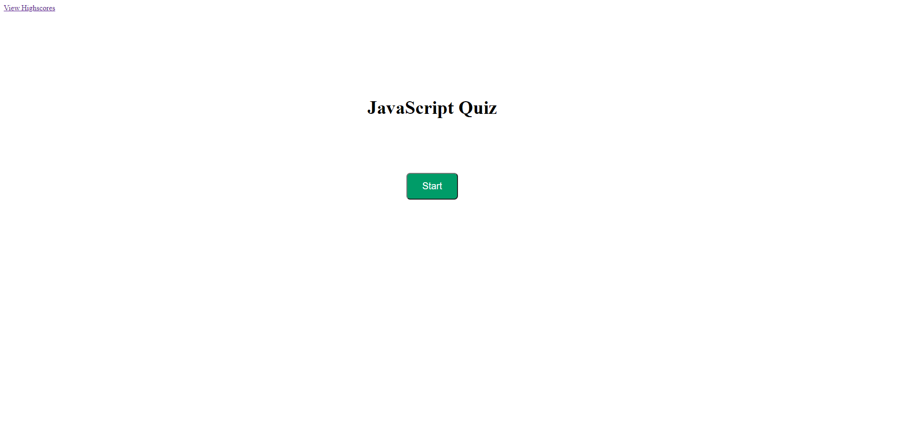

# JavaScript Quiz

In this assignment I was tasked with creating a quiz that would ask users questions about basic JavaScript. I also had to provide the user with an end score that they could save with their initials to view after they finished the quiz. 

You can check it out by clicking this link! https://jakech617.github.io/JavaScript-Quiz/

